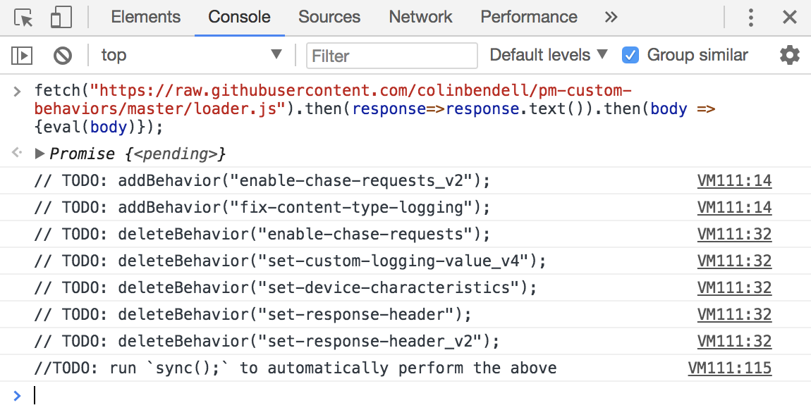

# Akamai Custom Behaviors for Property Manager

Akamai's configuration platform is called Property Manager. This allows you to manipulate both the logic state to fullfill requests and provide caching instructions. Often the rule/match/behavior meta structure is insufficient to accomplish tasks and Professional Services will introduce "Advanced Metatadata" or xml that manipulates the gHost platform. Unforunately this limits your ability to interact with the configuration by API. With Custom Behaviors, you can move these advanced metadata snippets into modules that are now mobile.

This repository is a collection of advanced metadata snippets that are commonly used.

## Installation
Please Akamai's official documented process for [adding customer behaviors and limitations](https://community.akamai.com/docs/DOC-9476)

## Convenience Loader (for faster installation)

For convenience, a helper loader is avaialble to expedite the creation of these behaviors. Only a person from Akamai PS, with elevated permission
can run this loader. To do so, they will need to first log into Luna, and switch contexts to your account.

Then, in the Chrome developer tools run:
```js
fetch("https://raw.githubusercontent.com/colinbendell/pm-custom-behaviors/master/loader.js").then(response=>response.text()).then(body => {eval(body)});
``` 
> After the initial loader eval, the console will emit `//TODO: addBehavior(..)` indicating which actions are pending



### Automatic sync (all)
To sync all behaviors: add new, depricate old: just run:
```js
sync();
```

### Manual sync

Alternatively, to run individually/selectively you can use the `addBehavior` and `deleteBehavior` functions. For example:

```js
addBehavior('my_custom_behavior_v3');
deleteBehavior('my_custom_behavior_v2');
```

## Behavior List
* `call-ipa-auth`: Make an arbitrary out-of-band Inter-Process-Agent request. Only success (200/304) response will allow the request to proceed. 
* `call-ipa-noauth`: Like above, without the auth linkage
* `disable-buffering`: Disables ghost-to-ghost buffering and increases the probabilty of chunked streaming
* `disable-esi-legacy-ops`: Disables legacy ESI operators. Needed for more advanced ESI use (like bitwise shifting, xor, etc) 
* `disable-gzip-classifier`: Disables the gzip classifier. This was needed to overcome a text classification bug in 2017Q4 
* `enable-browser-auth`: Granular control for Edge-Auth since the Property Manager behavior does not work with variables 
* `enable-chase-requests_v2`: Uses Fail-Action to simulate a `restart()`. Specifically looking for 302 responses and following those responses. 
* `enable-custom-logging`: Scope the custom logging to client-done to prevent pre-emptive variable evaluation 
* `enable-error-id-header`: When an error occurs, emit a header which allows an app to intercept the reason without parsing html  
* `enable-gzip-early`: Convenience method to enable lma.incoming at a parent tier. This is to work around a property manager bug that prevents this logic
* `enable-honor-cache-control2`: fine grain honor cache control mechanisms that arne't exposed in PM 
* `enable-hsaf_v2`: Enable hash-serial-and-forward - a technique when standard tiered distribution is insufficient and greater cache offload is required for longtail.
* `enable-server-timing_v8`: Enable the ServerTiming spec 
* `enable-single-refresh`: Collapse multiple stale cache hits (requiring refresh) to the origin into one request. 
* `enable-single-request_v2`: Collapse multiple incoming cache-miss requests into a single request to origin. other users get timetravel
* `enable-single-tls-cachekey`: Merge HTTP and HTTPS cache keys 
* `fix-content-type-logging`: Work around for a bug in Akamai logging that strips `;` and following characters from the logs preventing logging of `codecs` or other extensions.
* `invalidate-compressed-binary_v2`: Necessary work around because of a 2017Q4 bug which compressed mp4 files
* `match-ipa-change-path`:  Set specific variables based on IPA response intended to change the forward path
* `match-ipa`: set variables based on IPA responses
* `replace-incoming-header`: scope incoming header changes to client-response to avoid early evaluation of variables
* `replace-outgoing-header`: scope outgoing header changes to client-response to avoid early evaluation of variables 
* `set-cache-hit-variable_v2`: Set variables with the current and remote ghost server cache status (disk/mem/etc)
* `set-client-port-variable`: Set variables with the client port number
* `set-client-rtt`: Set variables with the current socket RTT
* `set-connection-details_v2`: Set variables with details of the TCP Connection 
* `set-content-type`: Work-around ghost bug which strips `;` and following characters from the Content-Type logs  
* `set-custom-logging-value_v5`: A shorthand tool to populate the custom-logging with values not available in the standard PM UI.
* `set-device-characteristics_v2`: Set variables with the EDC values
* `set-failaction-attempt`: Set a variable based on the number of `restart()` or fail-action count 
* `set-forward-base-variable`: Set the internal Property Manager forward path after specific calculations 
* `set-jwt-verify`: Use IPA to retrieve the JWT components and perform a verificiation on the client
* `set-poc-size-10mb`: Set the Partial Object Size to 10MB
* `set-response-header-size`: Set the max header response size to 16kb (deafult is 8kb)
* `set-response-header_v3`: Set variables based on response headers (IPA/Cache/Fwd)
* `set-rsa-sha256`: Transform variables with sha256
